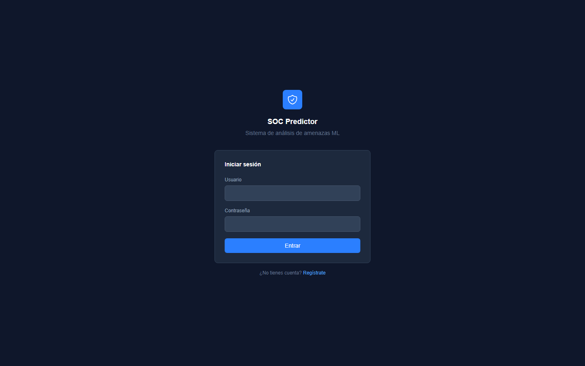

# SOC Alert Prioritization ML

> Web system that automatically classifies and prioritizes cybersecurity alerts using Machine Learning, to reduce the operational load on a SOC (Security Operations Center).

<!-- Optional: live demo badge -->
<!-- [](https://your-app.azurewebsites.net) -->



---

## 🧩 Problem / Context

Final degree project for the professional title at **Universidad Peruana de Ciencias Aplicadas (UPC)**. In a real SOC, analysts receive a volume of security alerts far beyond their manual review capacity, which delays detection and response to real threats (directly impacting the team's MTTD/MTTR). This system automates alert classification (`benigno` / `a_investigar` / `malicioso`) and risk-score calculation per alert, with SHAP-based explainability, so analysts can prioritize with real criteria instead of reviewing everything in arrival order.

---

## 🛠️ Tech Stack

| Layer            | Technology       |
|-------------------|------------------|
| Frontend          | Django Templates, Tailwind CSS |
| Backend           | Python, Django 6, Django REST Framework |
| ML                 | LightGBM, Scikit-learn, SHAP, Pandas, NumPy |
| Auth               | Django sessions (web UI) + JWT (`djangorestframework-simplejwt`, REST API) |
| Database           | SQLite (development) · PostgreSQL for Azure (production) |
| Reporting          | ReportLab, Matplotlib, OpenPyXL (PDF/Excel export) |
| AI-assisted        | Anthropic Claude API |
| Deployment / Infra | Azure App Service · Gunicorn |

---

## 🏗️ Architecture

Django multi-app project under `soc_project/`:

- **accounts** — authentication, roles (admin / analyst_n1 / analyst_n2 / analyst_n3 / trainee), user management
- **predictor** — ML pipeline, alert management, SHAP explainability, PDF/Excel reports
- **theme** — Tailwind CSS integration

Key decisions:
- **Two-stage hierarchical classification model** (stage 1: filters benign vs. the rest; stage 2: distinguishes to-investigate vs. malicious), trained with LightGBM and exposed via `predict_alert`/`predict_batch`.
- The ML model and SHAP explainers are **preloaded into memory** on Django startup (`predictor/apps.py.ready()`) — if `soc_model.pkl` doesn't exist, it's trained automatically on first run.
- Two **independent** authentication mechanisms: Django sessions for the web UI, JWT for the REST API (`/api/...`), intended for external integrations (e.g. SIEM/SOAR tools).

---

## 🧠 Technical challenges and decisions

- **Problem:** the alert model concentrated 45+ fields in a single table (ML input data, prediction output, investigation status, priority, evaluation, incident closure) → **Solution:** ongoing migration to a normalized schema (`Alert`, `AlertWorkflow`, `Incident`, `ModelVersion`, `PredictionLog`) → **Why:** separate raw data from operational workflow and enable model versioning + a feedback loop (comparing past predictions against the actual root cause the N3 analyst logs when closing an incident).
- **Problem:** computing SHAP during ingestion added ~25-30s per batch of alerts → **Solution:** *lazy* SHAP computation (on-demand, only when an analyst opens an alert's detail view) → **Why:** in practice an analyst only reviews explainability for 2-3 alerts, not the entire ingested batch.
- **Problem:** large alert uploads (10k+ rows) degraded database inserts → **Solution:** `bulk_create` with `batch_size=500` at every ingestion point → **Why:** inserting row by row (or without batching) doesn't scale on SQLite or PostgreSQL for realistic SOC volumes.
- **Problem:** 0% test coverage on a system that decides security alert priority → **Solution:** unit and integration test suite mapped 1:1 against the acceptance criteria defined by the QA team (30 user stories) → **Why:** you can't claim the prediction pipeline is reliable if it was never tested automatically.

---

## 🚀 Getting started

### 1. Prerequisites

- Python 3.11+
- pip

```bash
python --version
pip --version
```

### 2. Clone the repository

```bash
git clone https://github.com/Carlou134/soc-alert-prioritization-ml.git
cd soc-alert-prioritization-ml
```

### 3. Create and activate a virtual environment

```bash
python -m venv venv
```

**Windows:**
```bash
venv\Scripts\activate
```

**Linux / Mac:**
```bash
source venv/bin/activate
```

### 4. Install dependencies

```bash
pip install -r requirements.txt
```

### 5. Configure environment variables

```bash
cp .env.example .env
```

Edit `.env` at the project root:

```env
# Django
DJANGO_SECRET_KEY=your-secret-key-here
DJANGO_DEBUG=True
ALLOWED_HOSTS=

# Anthropic
ANTHROPIC_API_KEY=your-anthropic-api-key-here

# PostgreSQL (leave DB_HOST empty to use SQLite in local development)
DB_NAME=soc_db
DB_USER=postgres
DB_PASSWORD=your-db-password
DB_HOST=
DB_PORT=5432
```

> `ANTHROPIC_API_KEY` is required for the AI-assisted alert analysis feature.
> `DB_HOST` should only be set for PostgreSQL (production/Azure) — leave it empty to use SQLite locally, so you can run the project without depending on Azure.

### 6. Apply migrations

```bash
cd soc_project
python manage.py migrate
```

This command does three things automatically:
1. Creates the database schema (SQLite locally, PostgreSQL in production)
2. Seeds the default users (see credentials below)
3. **Trains the ML model** — if `predictor/ml/soc_model.pkl` doesn't exist, it's trained from `dataset_soc_alertas_train.csv` automatically. This may take a few minutes on first run.

### 7. Run the development server

```bash
python manage.py runserver
```

Open your browser at:

```
http://127.0.0.1:8000/
```

---

## 🔑 Default credentials

These users are created automatically by the migrations — useful for testing the different roles:

| Username | Password | Role |
|---|---|---|
| `admin_soc` | `Admin@2025` | Admin |
| `jacobo` | `Jacobo@2025` | Analyst N1 |
| `gian` | `Gian@2025` | Analyst N2 |
| `senior` | `Senior@2025` | Analyst N3 |
| `practicante_rios` | `Practicante@2025` | Trainee |

---

## 🧠 ML Model

The model is trained from `soc_project/dataset_soc_alertas_train.csv` and saved to `soc_project/predictor/ml/soc_model.pkl`.

To retrain from scratch: delete `soc_model.pkl` and restart the server.

---

## 🎓 Academic context

Developed as a final degree thesis project at **Universidad Peruana de Ciencias Aplicadas (UPC)**, as a team.

**Authors:** Carlos Vásquez · Giancarlo Moreno
