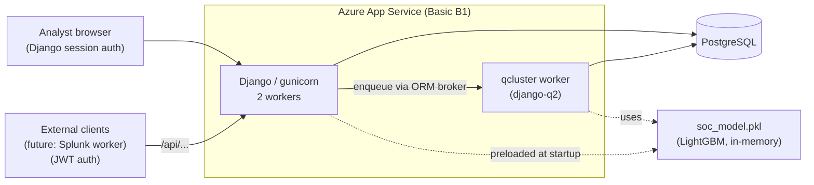
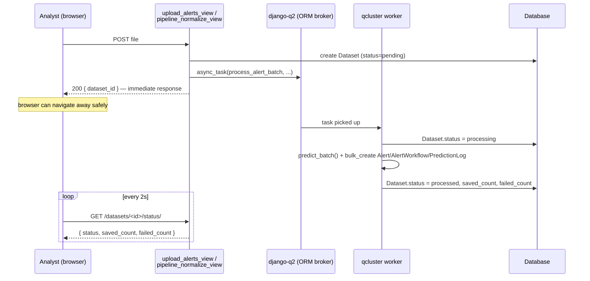

# Architecture

This document describes how the system is put together: the Django apps, the data model, the async ingestion pipeline, authentication, role-based visibility, and the deployment topology. For setup instructions, see the [README](../README.md). For *why* specific technologies were chosen over alternatives, see [technical.md](technical.md).

## System overview



Gunicorn and `qcluster` run as two processes inside the **same** App Service container (`startup.sh` backgrounds `qcluster` before starting gunicorn). They are not independently scalable — see [Deployment topology](#deployment-topology).

## Django apps

| App | Responsibility |
|---|---|
| `accounts` | Authentication (session + JWT), roles, user management, audit log (`UserActionLog`) |
| `predictor` | ML pipeline, alert lifecycle, SHAP explainability, reports, background ingestion tasks |
| `theme` | Tailwind CSS integration (no business logic) |

## Data model

The alert schema was originally a single 45+ field table mixing ML input, prediction output, investigation state, and incident closure. It was split into six normalized tables:

```mermaid
erDiagram
    Dataset ||--o{ Alert : "origin batch"
    Incident ||--o{ Alert : "groups (once escalated)"
    Alert ||--|| AlertWorkflow : "1:1, always created together"
    Alert ||--o{ PredictionLog : "history, latest wins"
    ModelVersion ||--o{ PredictionLog : "which model predicted"

    Dataset {
        string filename
        string status "pending/processing/processed/failed"
        int saved_count
        int failed_count
    }
    Alert {
        string event_category
        string severity
        string correlation_id
        fk dataset
        fk incident
    }
    AlertWorkflow {
        string investigation_status
        string analyst_priority
        string ml_evaluation
        fk assigned_to "nullable"
    }
    Incident {
        string correlation_id "unique"
        bool is_resolved
        string root_cause
    }
    ModelVersion {
        string version_label "unique"
        bool is_active
        json metrics
    }
    PredictionLog {
        string predicted_class
        float risk_score
        json probabilities
        json shap_values
    }
```

Design notes that deviate from the "obvious" schema and why:

- **`AlertWorkflow.assigned_to` is nullable**, not `NOT NULL` as the original DDL specified — a newly created alert has no owner until an analyst claims it. Every `Alert` creation path creates its paired `AlertWorkflow` in the same `bulk_create`, so the 1:1 relationship is a guaranteed invariant, not something templates need to defensively check.
- **`Incident.correlation_id` is unique**, but the source `Alert.correlation_id` defaults to `'unknown'` when a batch doesn't provide one. Escalating such an alert creates its own synthetic incident (`alert-{id}`) instead of merging unrelated alerts under a shared `'unknown'` bucket.
- **`PredictionLog` has no uniqueness constraint on `alert`** — an alert can accumulate several predictions over time (e.g. after a model retrain), which is the intended input for a future feedback loop that compares past predictions against the `root_cause` an analyst logs when closing an incident. `Alert.latest_prediction` is a `cached_property` returning the most recent one; it's cached because templates access it multiple times per row.
- **`ModelVersion` self-heals**: if none is active (e.g. a fresh install with no training history), the first prediction creates an `'initial'` placeholder instead of raising `DoesNotExist`.

### Supporting tables

Left out of the diagram above because they have no interesting relationships beyond a `FK` to `User` — listed here for completeness rather than diagrammed:

| Table | Key columns | Purpose |
|---|---|---|
| `UserProfile` | `user` (1:1), `role` | Role used for permission checks and queue visibility (`accounts/decorators.py`) |
| `UserActionLog` | `user`, `action`, `description`, `created_at` | Audit trail — every `log_action()` call (user creation, escalation, report export, etc.) |
| `ErrorLog` | `user`, `context`, `message`, `created_at` | Non-fatal errors caught during prediction/ingestion, logged instead of raised (`log_error()`) |
| `TurnoNota` | `contenido`, `autor`, `created_at` | Shift handoff notes shown on the dashboard |

## Prediction pipeline

The model is a **two-stage hierarchical classifier** (LightGBM):

1. **Stage 1** — binary: malicious vs. not.
2. **Stage 2** — for everything that isn't malicious: to-investigate vs. benign.

Both stages, plus their SHAP `TreeExplainer` instances, are loaded once into memory in `predictor/apps.py.ready()` — not per-request. `predict_alert()` scores a single record; `predict_batch()` scores a list of records and additionally aggregates `incident_*` features (evidence count, max/mean anomaly score, etc.) per `correlation_id`, so alerts belonging to the same real-world incident inform each other's score.

SHAP values are **not** computed at ingestion time — they're computed lazily, the first time an analyst opens an alert's detail view, and cached on that `PredictionLog` row from then on.

## Asynchronous alert ingestion



This replaced a design where the browser drove a second `fetch()` for "phase 2" of large uploads — if the analyst navigated away before it completed, everything past the first 10 preview rows was silently lost. `async_task()` persists the task to the database **before** the HTTP response is sent, so the task survives independently of the request/response cycle, the browser tab, or the analyst's session.

## Authentication

Two independent mechanisms, deliberately not unified:

- **Django sessions** — the web UI (`accounts.views.login_view`). `SESSION_COOKIE_AGE = 3600` with `SESSION_SAVE_EVERY_REQUEST = True` gives a 1-hour sliding window based on inactivity, not a fixed expiry from login.
- **JWT** (`djangorestframework-simplejwt`) — the REST API (`/api/...`), for programmatic/external clients. This is what the planned Splunk ingestion worker (see [Track 4](../README.md)) will authenticate with.

## Role-based alert visibility

`alert_list_view` filters what each role sees — this is enforced server-side in the queryset, not just hidden in the UI:

| Role | Sees |
|---|---|
| `analyst_n1`, `trainee` | Only alerts predicted `benigno` |
| `analyst_n2` | Alerts predicted `malicioso` or `a_investigar` (excludes `benigno` and unclassified) |
| `analyst_n3`, `admin` | Everything |

Alerts escalated to an `Incident` (`incident_id` set) leave the main queue entirely and move to the incident desk (`incident_desk_view`, restricted to `admin`/`analyst_n3`).

## Deployment topology

- **Azure App Service, Linux, Basic (B1) tier.** Free (F1) doesn't support "Always On", which this design depends on.
- `startup.sh` starts `qcluster &` before `gunicorn ... --workers 2`. Both run in the same container — `qcluster` is not an independently scaled process, and it dies if the container is recycled (deploy, manual restart, or — without "Always On" — idle timeout).
- **PostgreSQL** in production; **SQLite** for local development (`DB_HOST` empty in `.env`).
- Static files served by **WhiteNoise** (`CompressedManifestStaticFilesStorage`), requiring `collectstatic` to have run — the test suite overrides this to a manifest-less backend since `collectstatic` doesn't run in CI.

## Planned extension: SOC connector

Not yet implemented. The next integration point is a standalone **worker process** (not a Django view) that pulls alerts from a local Splunk Enterprise instance via its Search API and feeds them through the same ingestion path used by manual uploads — see the architecture map artifact for the current open design questions.
